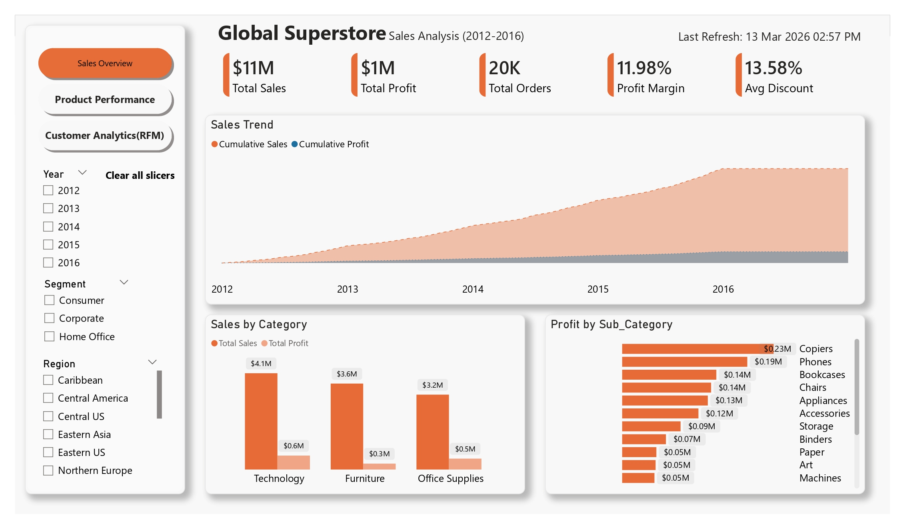
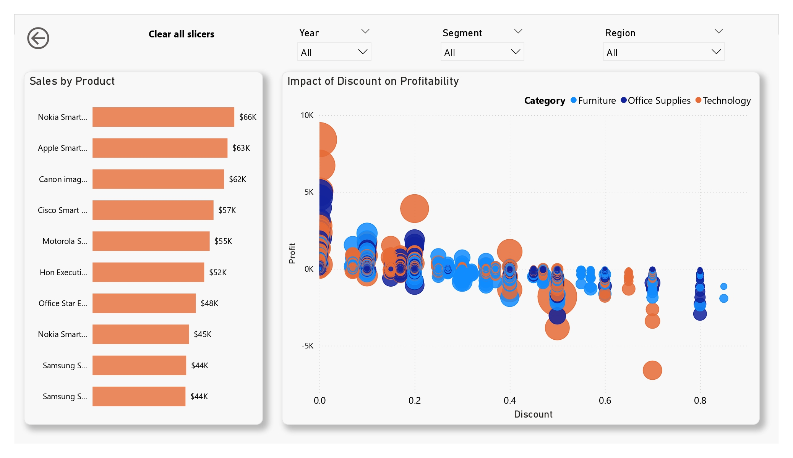
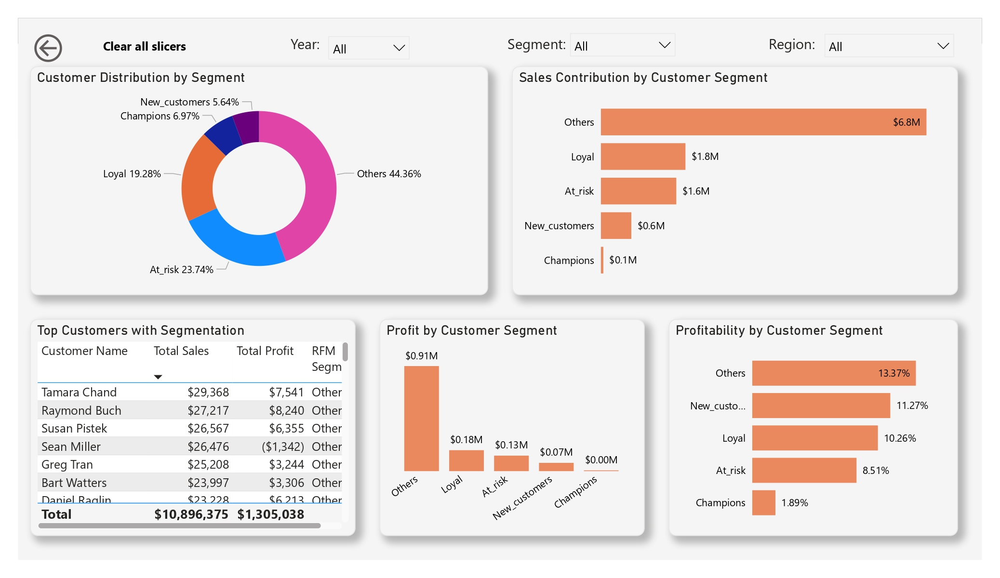

# Global Superstore Sales Analysis (SQL + Power BI)  
## Project Overview  
This project analyzes the Global Superstore dataset to uncover insights related to sales performance, customer behavior, product profitability, and regional trends.  
The analysis is performed using SQL (MySQL) and demonstrates intermediate to advanced analytical SQL techniques such as:  
* Aggregations
* Window functions
* Ranking functions
* Common Table Expressions (CTEs)
* Customer segmentation (RFM analysis)
* Pareto sales analysis
* Business-oriented analytical queries  
The goal of the project is to simulate how a data analyst explores retail sales data to generate actionable business insights.
Power BI dashboards was used to visualize the results of the analysis.

## Business Scenario  
Global Superstore is an international retail company that sells office supplies, furniture, and technology products across multiple regions.  
The management team wants to better understand:
*	Which products and categories drive the most revenue
*	Why some categories generate losses
*	Which customers contribute the most to sales
*	Whether heavy discounting is impacting profitability
*	Which customers may stop purchasing (churn risk)   
As a data analyst, the objective of this project is to analyze the sales data and provide data-driven insights to improve profitability and customer retention.

### Dataset
**Dataset**: Global Superstore  
**Source**: Kaggle  
The dataset contains retail transaction data including:
*	Orders
*	Returns
*	Regional managers  
Main tables used:
*	Orders – transactional sales data
*	Returns – returned orders
*	People – regional managers  
Important columns used in the analysis:
*	Order_ID
*	Customer_ID
*	Customer_Name
*	Product_ID
*	Product_Name
*	Category
*	Sub_Category
*	Sales
*	Profit
*	Discount
*	Region
*	Order_Date
*	Ship_Date

### Data Preparation
Before performing the SQL analysis, several preprocessing steps were performed.  

**Date Formatting**  
The dataset initially contained date columns stored as text.  
Using Microsoft Excel, the following columns were converted into proper date format:  
*	Order_Date
*	Ship_Date  
This ensured compatibility with SQL date functions such as:
*	YEAR()
*	DATEDIFF()
*	DATE_FORMAT()

**Data Modeling**  
After cleaning the dataset, it was imported into MySQL Workbench.  
To maintain data integrity, Primary Key and Foreign Key relationships were defined between tables.  
Example relationships:  

Orders
*	Order_ID → Primary Key  
Returns  
*	Order_ID → Foreign Key referencing Orders.Order_ID  
People
*	Region → Associated with Orders.Region  
This relational structure allows efficient analysis across multiple tables.

**Data Validation Issue**  
While defining the foreign key relationship between Orders and Returns, a data inconsistency was discovered.  
Some Order_ID values in the Returns table did not exist in the Orders table.  
These records are called orphan records, which violate referential integrity.  
To resolve this issue:
*	Orphan Order_ID values were identified.
*	Invalid records were removed from the Returns table.
*	The foreign key relationship was successfully implemented.  
This ensured consistent relational integrity across the database before performing analysis.

**Database Schema**  
The dataset was modeled as a relational database with three primary tables:  
Orders (transactional data)  
Returns (returned orders)  
People (regional managers)  

Example relationship structure:  

Orders  
│  
|__ Order_ID (Primary Key)  
|__ Customer_ID  
|__ Product_ID  
|__ Sales  
|__ Profit  
|__ Order_Date  
Returns  
│__ Order_ID (Foreign Key → Orders)  
People  
│__ Region  
(A schema diagram will be added in future updates.)  

### Tools & Technologies
Tools used in this project:
*	MySQL – Data analysis
*	MySQL Workbench – Database management
*	Microsoft Excel – Data preprocessing
*	Power BI – Data visualization 
*	GitHub – Project documentation and version control

**SQL Analysis**  
The project contains 35+ SQL queries organized into several analytical sections.

1. Data Exploration  
Initial exploration to understand dataset structure.  
Examples:
*	Total number of records
*	Unique customers
*	Categories and regions available in the dataset  
2. Data Validation  
Data quality checks including:
*	Duplicate orders
*	Negative profit transactions
*	Discount outliers
*	Shipping delays
3. Sales & Profit Analysis  
Understanding overall business performance.  
Examples:
*	Total sales and total profit
*	Sales by category and sub-category
*	Top selling products
*	Loss-making products
4. Customer Analysis  
Analyzing customer purchasing behavior.   
Examples:
*	Top customers by revenue
*	Customers with highest order frequency
*	Average sales per customer
5. Time-Based Analysis  
Understanding sales trends over time.  
Examples:  
*	Monthly sales trends
*	Year-over-year sales growth
*	Average delivery time  
6. Advanced SQL Analysis  
Advanced analytical queries were used to answer complex business questions.  
Examples:  
*	Ranking products by sales within each category
*	Top 3 products in each region
*	Running total of sales
*	Category contribution to total revenue
*	Identifying multi-region customers
7. RFM Customer Segmentation  
Customers were segmented using RFM analysis.  
RFM metrics:
*	Recency – How recently a customer purchased
*	Frequency – Number of orders
*	Monetary – Total spending  
Customer segments created:  
*	Champions
*	Loyal Customers
*	New Customers
*	At-Risk Customers
*	Lost Customers  
This helps identify high-value customers and churn risks.  
8. Pareto Sales Analysis (80/20 Rule)  
A Pareto analysis was conducted to understand sales distribution among customers.  
The analysis calculated:  
*	Sales contribution by each customer
*	Cumulative sales percentage
*	Customers responsible for the majority of revenue

9. Discount vs Profitability Analysis  
This analysis examined how discount levels affect profitability.  
Discounts were grouped into bands:
*	Low
*	Moderate
*	Medium
*	High
*	Very High  
Metrics compared:
*	Total sales
*	Total profit
*	Average profit  
This helps determine whether aggressive discounting negatively impacts profitability.

### Dashboard (Power BI)
#### Sales Overview

#### Product Performance

#### Customer Analytics(RFM)

### Key Insights
**Important insights from the analysis include**:
*	The Technology category generates the highest overall sales revenue.
*	Several Furniture sub-categories consistently generate losses.
*	Heavy discounting significantly reduces profitability for certain products.
*	A small percentage of customers contribute a large portion of total revenue, supporting the Pareto principle.
*	Some regions generate high sales but relatively low profit margins.
*	Customers who have not ordered recently are at risk of churn.

**Business Recommendations**
Based on the analysis, the following actions are recommended:
*	Review pricing strategies for loss-making product categories.
*	Limit high discount levels that reduce profit margins.
*	Focus retention strategies on high-value customers identified through RFM segmentation.
*	Monitor regions with high sales but low profit margins to improve operational efficiency.
*	Introduce loyalty programs to increase customer retention.

**Project Structure**  
Global-Superstore-SQL-Analysis  
|  
|-- dataset  
|    |-- global_superstore.csv  
|  
|-- sql_queries  
|    |-- 01_data_exploration.sql  
|    |-- 02_sales_analysis.sql  
|    |-- 03_customer_analysis.sql  
|    |-- 04_time_analysis.sql  
|    |-- 05_advanced_analysis.sql  
|    |-- 06_rfm_segmentation.sql  
|-- README.md

#### Author  
This project was created as part of a data analytics portfolio to demonstrate SQL & Power BI skills applied to real-world business analysis.

